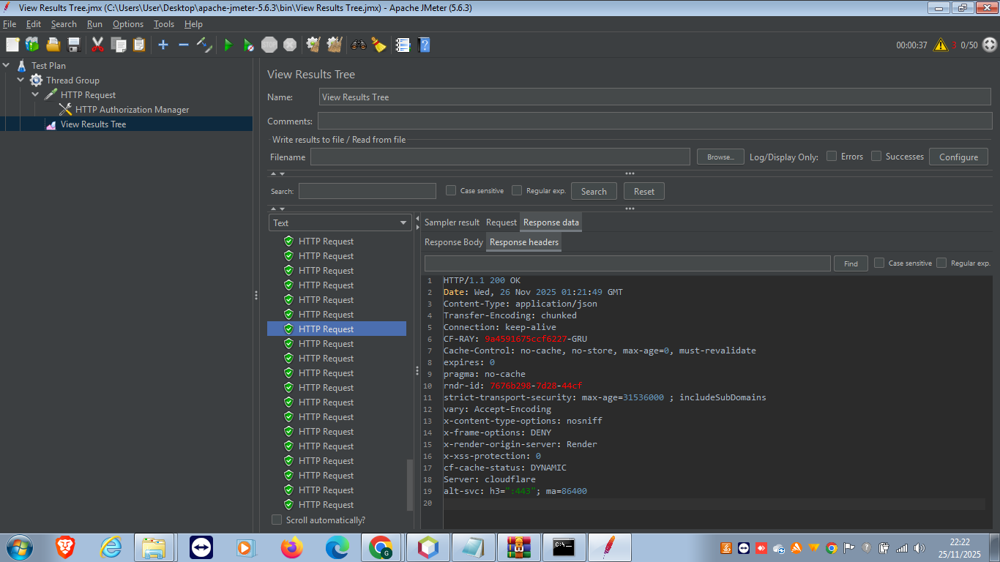

# Sistema Acadêmico - API REST

Este projeto é uma API REST desenvolvida para o trabalho da disciplina de Desenvolvimento Backend. O sistema gerencia o cadastro de alunos, cursos e matrículas.

## 🚀 Tecnologias Utilizadas
* **Java 21**
* **Spring Boot 3**
* **Spring Data JPA**
* **H2 Database** (Banco de dados em memória)
* **Spring Security** (Autenticação Básica)
* **Swagger / OpenAPI** (Documentação)
* **Docker** (Containerização para Deploy)

## 🌐 Acesso Online (Deploy)
O sistema está rodando na nuvem pelo Render.
* **Link da Documentação (Swagger):** [Acessar Sistema Online](https://sistema-academico-av2-leonardo.onrender.com/swagger-ui/index.html)
* **Usuário:** `user`
* **Senha:** *(Verificar nos logs do Render, pois muda a cada reinício)*

## 🛠️ Como rodar localmente
1.  Clone este repositório.
2.  Abra o projeto no NetBeans ou IntelliJ.
3.  Execute a classe `SistemaAcademicoApplication.java`.
4.  Acesse no navegador: `http://localhost:8080/swagger-ui/index.html` (A porta pode variar conforme configuração).

## 📚 Funcionalidades (Endpoints)
* **Alunos:** Listar, Cadastrar.
* **Cursos:** Listar, Cadastrar.
* **Matrícula:** Relacionamento N:N entre Aluno e Curso.

## 📝 Documentação da API
A documentação completa dos endpoints pode ser visualizada através do **Swagger UI**, acessível tanto localmente quanto no link de deploy.

---
**Desenvolvido por:** [Gleiverson Ferreira Vinagre]

## ⚠️ Observação sobre Monitoramento e Docker
Devido a limitações de hardware e sistema operacional (Windows 7), não foi possível realizar a configuração do ambiente Docker para rodar o Prometheus e Grafana conforme sugerido no roteiro. 
O foco do trabalho foi na implementação robusta do Backend (Spring Boot), Segurança, Documentação (Swagger) e Deploy na Nuvem (Render).

## 🧪 Evidência de Teste de Carga
Teste de stress realizado com JMeter simulando múltiplos acessos simultâneos:

